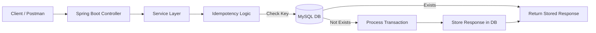
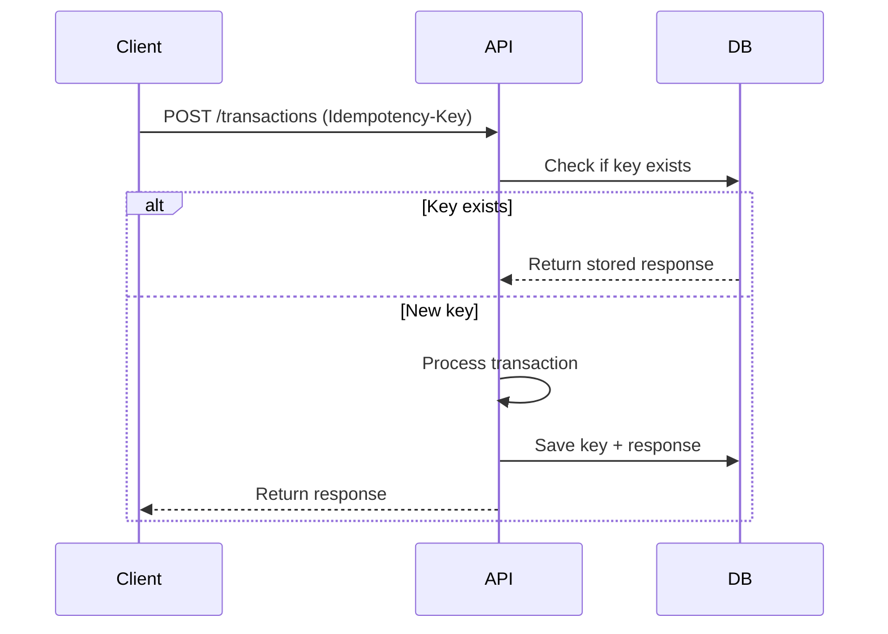

# POS Transaction Service

A Spring Boot-based backend service that implements **idempotent transaction APIs**, ensuring duplicate requests do not result in duplicate processing — a critical requirement in payment systems.

---

## Features

* ✅ Idempotent API handling using `Idempotency-Key`
* ✅ Prevents duplicate transaction processing
* ✅ RESTful APIs with Spring Boot
* ✅ MySQL database integration
* ✅ Dockerized setup (App + DB)
* ✅ JPA/Hibernate for persistence

---

## Architecture Diagram



---

## API Flow (Idempotency)



---

## Run with Docker

### 1. Build the application

```bash id="build001"
mvn clean package -DskipTests
```

### 2. Start services

```bash id="docker002"
docker-compose up --build
```

---

## API Endpoints

### 🔹 Create Transaction

**POST** `/transactions`

#### Headers:

```id="header003"
Idempotency-Key: <unique-key>
```

#### Example:

```bash id="curl004"
curl -X POST http://localhost:8080/transactions \
-H "Idempotency-Key: 12345"
```

---

##  Screenshots

###  API Response

```
/target/API testing.jpg
```

---

###  MySQL Data Verification


```
/target/Mysql.png
```

---

##  Database Schema

**Table: idempotency**

| Column          | Description         |
| --------------- | ------------------- |
| id              | Primary key         |
| idempotency_key | Unique request key  |
| response        | Stored API response |
| endpoint        | API endpoint        |
| method          | HTTP method         |

---

##  Configuration

```properties id="config005"
spring.datasource.url=jdbc:mysql://mysql:3306/pos_db
spring.datasource.username=root
spring.datasource.password=root

spring.jpa.hibernate.ddl-auto=update
spring.jpa.show-sql=true
```

---

##  Use Case

This project demonstrates how systems like **Stripe / Razorpay** handle:

* Safe retries
* No duplicate transactions
* Reliable API behavior

---

##  Tech Stack

* Java 21
* Spring Boot
* Spring Data JPA
* MySQL
* Docker & Docker Compose

---


## ‍ Author

**Tejashwini S**

---

##  If you like this project

Give it a star ⭐ on GitHub!
